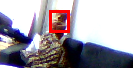

# SofaChecker: Telegram bot for seat availability in lounges.



A small Telegram bot that can be used to check traffic in public lounges. Only 100
lines of code!

## Case: sofa availability in guild room

Computational Engineering students from LUT university love to spend time
in their guild room, a lounge where you can study, play games and most
importantly, relax in the sofa zone! The sofa zone has gone so popular, 
that very often it's full and students has to find other premises to hang out.
Instead of wasting time to travel to guild room only to be deceived that the 
there's no seats left, use SofaChecker to gather real-time information of the
traffic in the guild room!

## Methodology

We use YOLOv8 -based model for person detection. We use a pre-trained model
from [https://github.com/Owen718/Head-Detection-Yolov8](https://github.com/Owen718/Head-Detection-Yolov8),
trained for human head detection. After several experiments, we concluded
this to be the best model in terms of model size and average accuracy. The bot
performs an analysis based on the number of detected heads.

The SofaChecker was designed to accommodate resources of Raspberry Pi 4, 
where the detection itself takes at least 10 seconds with the 
model! Thus, the process of gathering real-life data is threaded, so the 
interaction with the bot is always smooth!. The update interval can be easily
changed, like other traffic evaluation parameters and messages.

## Dependencies:

```
torch
torchvision
ultralytics
imageio[ffmpeg]
telebot
```

## Usage

Use you own Telegram bot instance by running

```python
python3 sofa_checker.py
```

The current implementation of SofaChecker recognizes following commands

* /start
* /hello
* /status
* /view
* /count
* /help

## Declarations

This project was created as a challenge in Lateksii Hackaton. All authors in 
the project declare that they have no conflict of interest.
